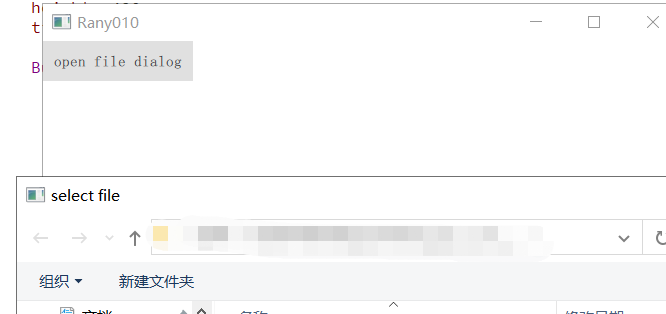
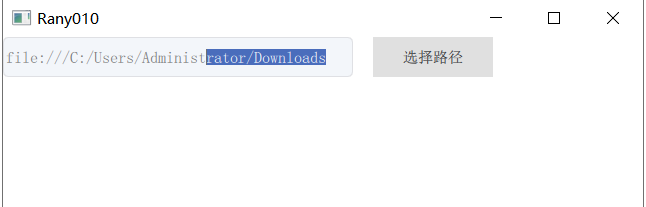
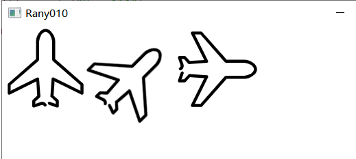
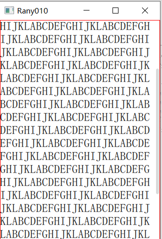

Title
===
qmlComponentLib，qml自定义控件集


## Authors
- Name:  `Rany010`
- Email:  `rany010.y@gmail.com`

## Install & Dependence
- linux
- win
- mac

## Use
- start:Open the .pro file of the corresponding sub-warehouse and run it

## Directory Hierarchy
- button
- checkBox
- fileDialog
- folderDialog
- imgButton
- imgTransformRotation
- menuCombox
- rangeSlider
- scrollBarTextEdit

## Effect preview
- button
 
- checkBox
 
- fileDialog

- folderDialog
 
- imgButton
 
- imgTransformRotation
 
- menuCombox
 
- rangeSlider

- scrollBarTextEdit



## Code Details
### Tested Platform
- software
  ```
  qt
  ```
- hardware
  ```
  ```

## References
- [paper-1]()
- [paper-2]()
  
## Other
- If you find this helpful, please give it a star, it will motivate me a lot.
- My level is limited and there may be many aspects that are not fully considered. Welcome to raise issues and make progress together
